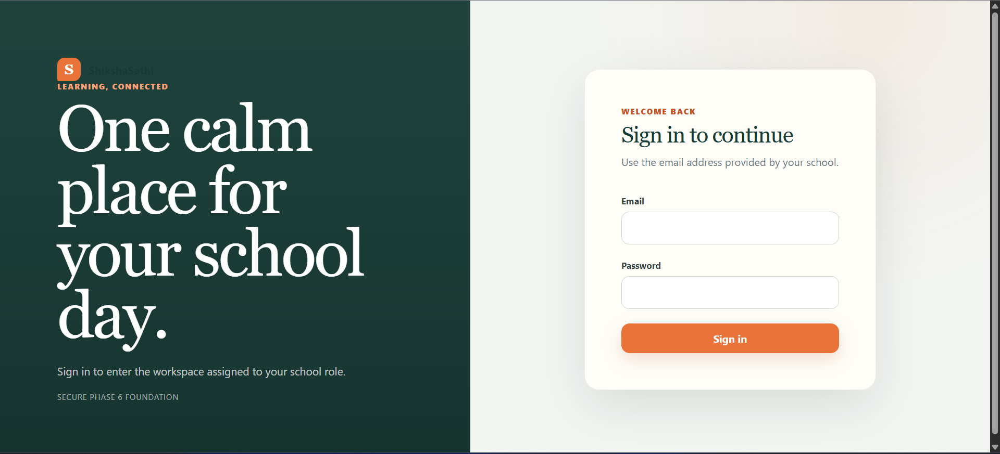
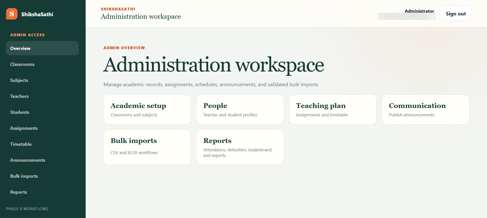
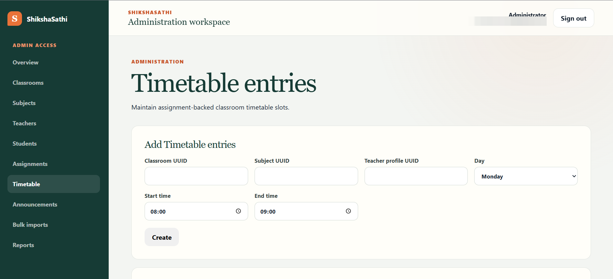
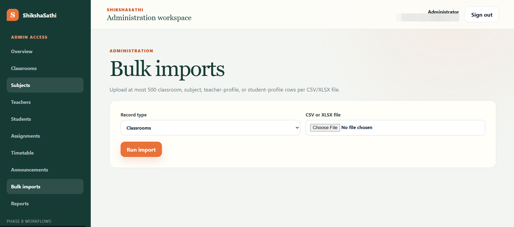
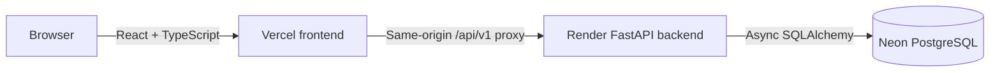

# ShikshaSathi

> A full-stack school operations and analytics platform with role-based academic, attendance, reporting, and decision-support workflows.

[](https://shikshasathi.vercel.app)
[](https://shikshasathi-api.onrender.com/health/live)
[](frontend/)
[](backend_v2/)
[](docker-compose.yml)
[](https://github.com/KYogeshPandey/ShikshaSathi/actions)

## Live Demo

**Application:** https://shikshasathi.vercel.app
**Backend health:** https://shikshasathi-api.onrender.com/health/live
**Repository:** https://github.com/KYogeshPandey/ShikshaSathi

The hosted demo uses a free Render backend, so the first request after inactivity can take longer while the backend wakes up.

Authentication is required. Public administrator credentials are intentionally **not** stored in this repository. There is no public self-registration endpoint.

---

## What is ShikshaSathi?

ShikshaSathi is a role-based school management platform focused on academic administration and attendance workflows.

It provides separate experiences for:

- **Administrators** — manage classrooms, subjects, teachers, students, assignments, timetable, announcements, bulk imports, and reports.
- **Teachers** — view schedules, work within assigned academic scopes, and record attendance.
- **Students** — view their dashboard, attendance information, and school announcements.

The project also contains an optional biometric enrollment and face-recognition workflow. The live free-hosting deployment keeps face recognition disabled because the native `dlib` dependency and model runtime are resource intensive.

---

## Screenshots

<table>
  <tr>
    <td width="50%" align="center">
      
      <br><b>Secure Login</b>
    </td>
    <td width="50%" align="center">
      
      <br><b>Administration Dashboard</b>
    </td>
  </tr>
  <tr>
    <td width="50%" align="center">
      
      <br><b>Timetable Management</b>
    </td>
    <td width="50%" align="center">
      
      <br><b>Bulk Import Workflow</b>
    </td>
  </tr>
</table>

The screenshots above show the live application UI. Personal account information has been redacted before publication.

---

## Key Features

### Administration

- Classroom management
- Subject management
- Teacher profiles
- Student profiles
- Teacher/classroom/subject assignments
- Timetable management
- School announcements
- CSV/XLSX bulk-import workflows
- Role-aware administration dashboard

### Attendance

- Manual attendance workflows
- Teacher authorization and scope validation
- Attendance audit trail
- Student attendance views
- Attendance statistics
- Roster-based workflows
- Recognition-attendance workflow support

### Reports & Analytics

- Role-aware admin, teacher, and student analytics dashboards
- Seven-day and 30-day attendance trends from real marked records
- Equal-duration previous-period comparisons in percentage points
- School population KPIs for administrators
- Assignment-scoped attendance and schedule context for teachers
- Private personal attendance trends for students
- Lowest recorded-attendance classroom signals for administrators, clearly separated from policy thresholds
- Attendance summary reports
- Attendance detail reports
- Defaulter identification
- Attendance leaderboard
- CSV exports
- PDF exports
- Deterministic report ordering
- Spreadsheet formula-injection protection for CSV exports

### Authentication & Security

- JWT access-token authentication
- HttpOnly refresh-token flow
- Role-Based Access Control (RBAC)
- Login rate limiting
- Trusted-host validation
- Production CORS validation
- Request IDs
- Secure production-cookie configuration
- No public self-registration
- Environment-based secret management
- No real `.env` or private-key files committed to Git

### Optional Face Recognition

The codebase includes:

- Biometric enrollment workflows
- Secure ZIP validation for bulk enrollment
- Image validation and bounded processing
- YuNet-based face detection integration
- `dlib` ResNet embedding integration
- Similarity matching and ambiguity handling
- Recognition attendance attempts
- Model artifact integrity checks

`dlib` is an **optional dependency** for the free deployment profile and is not installed in the default hosted backend image.

Biometric model files, student biometric data, and real enrollment images are **not included** in the repository.

---

## Architecture



### Production

```text
Browser
  │
  ▼
Vercel Frontend
React + TypeScript + Vite
  │
  │ /api/v1 same-origin proxy
  ▼
Render Backend
FastAPI + Uvicorn
  │
  ▼
Neon PostgreSQL
```

The frontend uses a same-origin `/api` rewrite, so the browser communicates with the Vercel domain while Vercel proxies API traffic to the Render backend.

### Local Docker Development

```text
Browser
  │
  ▼
Frontend / Nginx :8080
  │
  ▼
FastAPI backend
  │
  ▼
PostgreSQL
```

Database migrations run through the Compose migration service before the backend becomes available.

---

## Tech Stack

| Area | Technology |
|---|---|
| Frontend | React, TypeScript, Vite |
| Client data layer | TanStack Query |
| Backend | FastAPI, Python 3.12 |
| Validation | Pydantic / Pydantic Settings |
| ORM | SQLAlchemy 2.x Async |
| PostgreSQL driver | asyncpg |
| Database migrations | Alembic |
| Database | PostgreSQL 16 |
| Production database | Neon PostgreSQL |
| Authentication | JWT access tokens + refresh-token cookies |
| Reports | CSV + ReportLab PDF |
| Face detection | OpenCV YuNet |
| Face embeddings | dlib ResNet — optional |
| Local infrastructure | Docker + Docker Compose |
| Frontend runtime | Nginx |
| Backend runtime | Uvicorn |
| Frontend hosting | Vercel |
| Backend hosting | Render |
| CI | GitHub Actions |

---

## Repository Structure

```text
ShikshaSathi/
├── .github/
│   └── workflows/
│       └── ci.yml
├── backend/                 # Legacy Flask backend retained as migration reference
├── backend_v2/              # Current / authoritative FastAPI backend
│   ├── alembic/
│   ├── app/
│   ├── scripts/
│   ├── Dockerfile
│   ├── alembic.ini
│   └── pyproject.toml
├── frontend/                # Current React + TypeScript + Vite frontend
│   ├── src/
│   ├── Dockerfile
│   ├── nginx.conf
│   ├── package.json
│   └── vercel.json
├── docs/
├── .env.example
├── docker-compose.yml
├── API_DOCS.md
└── README.md
```

> **Important:** `backend_v2/` is the current application backend.
> `backend/` is legacy code preserved for migration/history reference and is not used by the production deployment.

---

# Run Locally

The recommended local setup uses Docker Compose.

## Prerequisites

Install:

- Git
- Docker Desktop
- Docker Compose

Verify:

```bash
git --version
docker --version
docker compose version
```

## 1. Clone the Repository

```bash
git clone https://github.com/KYogeshPandey/ShikshaSathi.git
cd ShikshaSathi
```

## 2. Create the Local Environment File

### Windows PowerShell

```powershell
Copy-Item .env.example .env
code .env
```

### Linux / macOS

```bash
cp .env.example .env
```

For local development, update at least:

```env
APP_ENV=development
DEBUG=false

SECRET_KEY=replace-with-a-unique-random-secret-at-least-32-characters

CORS_ALLOWED_ORIGINS=["http://localhost:8080","http://127.0.0.1:8080"]
TRUSTED_HOSTS=["localhost","127.0.0.1"]

REFRESH_TOKEN_COOKIE_SECURE=false

POSTGRES_DB=shikshasathi
POSTGRES_USER=shikshasathi
POSTGRES_PASSWORD=replace-with-a-unique-local-database-password

FACE_RECOGNITION_PROVIDER=none
```

Do **not** commit `.env`.

## 3. Validate Docker Compose

```bash
docker compose config
```

## 4. Build and Start

```bash
docker compose up -d --build
```

Check status:

```bash
docker compose ps
```

## 5. Verify Health

### PowerShell

```powershell
Invoke-WebRequest http://localhost:8080/health/live -UseBasicParsing
Invoke-WebRequest http://localhost:8080/health/ready -UseBasicParsing
```

### curl

```bash
curl http://localhost:8080/health/live
curl http://localhost:8080/health/ready
```

Both should return HTTP `200`.

## 6. Create the First Administrator

```bash
docker compose exec backend_v2 python -m scripts.bootstrap_admin
```

The command prompts for an admin email and password. The password is not echoed.

There is no public registration route.

## 7. Open the Application

Visit:

```text
http://localhost:8080
```

Sign in with the administrator account created above.

## Stop the Local Stack

```bash
docker compose down
```

To also delete the local PostgreSQL volume:

```bash
docker compose down -v
```

> `docker compose down -v` is destructive and deletes local database data.

---

# Production Deployment

## Frontend — Vercel

**https://shikshasathi.vercel.app**

Configuration:

```text
Root Directory: frontend
Framework: Vite
VITE_API_URL=/api/v1
```

`frontend/vercel.json` handles SPA fallback and `/api/*` proxying to Render.

## Backend — Render

**https://shikshasathi-api.onrender.com**

Health:

```text
https://shikshasathi-api.onrender.com/health/live
https://shikshasathi-api.onrender.com/health/ready
```

Configuration:

```text
Root Directory: backend_v2
Runtime: Docker
Health Check Path: /health/ready
```

Important environment variables:

```text
APP_ENV
DEBUG
DATABASE_URL
DATABASE_ECHO
LOG_LEVEL
SECRET_KEY
CORS_ALLOWED_ORIGINS
TRUSTED_HOSTS
REFRESH_TOKEN_COOKIE_SECURE
REFRESH_TOKEN_COOKIE_SAMESITE
POSTGRES_DB
POSTGRES_USER
POSTGRES_PASSWORD
FACE_RECOGNITION_PROVIDER
```

Real values must remain in the hosting platform and never be committed.

## Database — Neon PostgreSQL

The application uses an async SQLAlchemy connection URL:

```text
postgresql+asyncpg://...
```

Migrations are managed with Alembic.

Current release migration head:

```text
4f8c1a6e92b7
```

---

# API

The application exposes versioned APIs under:

```text
/api/v1
```

See:

- [`API_DOCS.md`](API_DOCS.md)
- [`backend_v2/README.md`](backend_v2/README.md)

Example protected endpoint:

```bash
curl -i https://shikshasathi.vercel.app/api/v1/auth/me
```

Without authentication, `401 Unauthorized` is expected.

---

# CI & Quality

The repository includes GitHub Actions checks covering:

- Backend tests
- Frontend tests
- Python formatting/linting
- Type checking
- Frontend linting
- Frontend type checking
- Production builds
- Dependency auditing
- Migration validation
- Docker image validation

Current verified frontend suite: **50 automated tests** across API contracts,
authentication/routing, administrative workflows, attendance, recognition,
reports, loading UX, and analytics.

Current verified backend suite: **723 automated tests** across API, database,
authorization, security, migration, attendance, reporting, biometric, and
analytics behavior.

See `.github/workflows/ci.yml`.

Analytics coverage includes calculation boundaries, equal-period comparisons, empty windows,
role-derived authorization, teacher assignment isolation, student self-scope, query shape,
accessible trend summaries, period controls, and dashboard failure states.

---

# Security Notes

- Never commit `.env`.
- Never commit production DB passwords.
- Never commit JWT/secret keys.
- Never commit private keys or certificates.
- Production secrets belong in hosting environment variables.
- Public self-registration is intentionally disabled.
- Biometric images and embeddings must not be committed.
- Model artifacts should be independently obtained and integrity checked.

If a secret is accidentally published, removing it from Git is not enough — rotate/revoke it.

---

# Face Recognition Notes

The live free demo uses:

```env
FACE_RECOGNITION_PROVIDER=none
```

The optional dependency group is:

```bash
pip install -e ".[face-recognition]"
```

Depending on the platform, installing `dlib` may require native C++ build tools.

Before enabling biometric workflows in a real environment, review consent/privacy requirements, model integrity, threshold calibration, FAR/FRR, and liveness requirements.

See:

- [`docs/BIOMETRIC_DATA_POLICY.md`](docs/BIOMETRIC_DATA_POLICY.md)
- Phase 5 handover documents in `docs/`

---

# Documentation

Useful documentation:

- [`docs/ARCHITECTURE.md`](docs/ARCHITECTURE.md)
- [`docs/AUDIT.md`](docs/AUDIT.md)
- [`docs/IMPLEMENTATION_PLAN.md`](docs/IMPLEMENTATION_PLAN.md)
- [`docs/PROGRESS.md`](docs/PROGRESS.md)
- [`docs/LEGACY_MIGRATION_MAP.md`](docs/LEGACY_MIGRATION_MAP.md)
- [`docs/BIOMETRIC_DATA_POLICY.md`](docs/BIOMETRIC_DATA_POLICY.md)
- [`docs/adr/`](docs/adr/)

---

# Current Deployment Profile

| Component | Service | Status |
|---|---|---|
| Frontend | Vercel | Live |
| Backend | Render | Live |
| Database | Neon PostgreSQL | Live |
| Source | GitHub | Public |
| CI | GitHub Actions | Configured |
| Face recognition | Optional | Disabled on free hosted demo |

---

# Known Limitations

- Free backend hosting can introduce a cold-start delay after inactivity.
- Face recognition is disabled in the hosted free-tier deployment.
- Biometric model files are intentionally not bundled.
- `backend/` remains as legacy migration reference; `backend_v2/` is authoritative.
- Real-world biometric calibration and liveness validation are outside the hosted demo scope.
- This is an academic/portfolio project, not a production service for real student biometric deployment.
- Attendance analytics describe marked records only; they do not infer absence from missing or unmarked records and do not make predictive or causal claims.

---

# Roadmap

Future portfolio-edition work may include:

- Monitoring and observability
- Stronger security/property testing
- Performance optimization
- Backup/restore workflows
- Biometric lifecycle improvements
- Deployment reliability improvements
- Optional, policy-defined attendance targets if a real institutional requirement is established

---

# Author

**Yogesh Pandey**

GitHub: [@KYogeshPandey](https://github.com/KYogeshPandey)

---

# License

This repository is intended for academic and portfolio use.

Unless a separate `LICENSE` file explicitly grants additional rights, no open-source license should be assumed.

---

## Project Status

**Portfolio-ready full-stack platform — Live**

- GitHub publication complete
- Frontend deployed
- Backend deployed
- Cloud PostgreSQL connected
- Authentication verified
- Core administration pages smoke-tested
- Role-aware attendance analytics implemented

**Live:** https://shikshasathi.vercel.app
