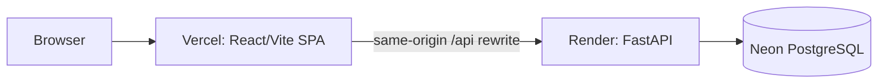

# ShikshaSathi

> A full-stack school operations, attendance, reporting, and analytics platform
> for administrators, teachers, and students.

[](https://shikshasathi.vercel.app)
[](https://shikshasathi-api.onrender.com/health/live)
[](frontend/)
[](backend_v2/)
[](https://github.com/KYogeshPandey/ShikshaSathi/actions)

## Overview

ShikshaSathi is a portfolio-ready school management application built around
role-scoped academic and attendance workflows. The current application is the
React/TypeScript frontend in `frontend/`, the FastAPI backend in `backend_v2/`,
and PostgreSQL. The older Flask code in `backend/` is retained only as legacy
source and is not part of the production runtime.

- **Live frontend:** <https://shikshasathi.vercel.app>
- **Backend health:** <https://shikshasathi-api.onrender.com/health/live>
- **API prefix:** `/api/v1`

The hosted backend may have a cold-start delay after inactivity. Authentication
is required, public administrator credentials are not committed, and there is
no public self-registration endpoint.

## Features

### Administration and academics

- Classrooms, subjects, teacher profiles, student profiles, and assignments
- Timetable management and role/classroom-targeted announcements
- CSV/XLSX imports with file, row, schema, and error-reporting bounds
- Soft-deactivation workflows and database-backed authorization

### Attendance, reports, and analytics

- Exact teacher/classroom/subject authorization for attendance operations
- Transactional manual attendance with immutable success/blocked audit events
- Student self-service attendance details and statistics
- Attendance summaries, defaulters, leaderboards, formula-safe CSV, and PDF
- Role-aware 7-day and 30-day dashboards backed by marked attendance records
- Deterministic demo dataset for portfolio evaluation

### Authentication and security

- Argon2id passwords and short-lived JWT access tokens
- Rotating opaque refresh sessions in path-scoped HttpOnly cookies
- Database-reloaded roles, role guards, and object-level authorization
- Login, OTP, password-reset, and other sensitive-route rate limits
- Optional six-digit email OTP before login session issuance
- Secure OTP-based password reset with a short-lived single-use reset grant
- Refresh-session revocation after password changes or rotated-token reuse
- Explicit production CORS/trusted-host validation and sanitized error responses

### Reviewed image-assisted attendance

- Private biometric enrollment with bounded image and ZIP validation
- Server-side YuNet detection and dlib embedding adapters when configured
- Matching limited to the authorized active classroom roster
- Multi-face proposals that require teacher review and explicit confirmation
- No automatic attendance write for `FOUND`, unknown, ambiguous, duplicate,
  missed, or unmarked faces
- No classroom-image or per-request embedding retention

Face recognition is implemented but optional. A deployment may keep
`FACE_RECOGNITION_PROVIDER=none`; the hosted free-tier backend may therefore
have recognition disabled. Model files are not bundled, real classroom
accuracy is not claimed, and operational use requires the safeguards in the
[biometric data policy](docs/BIOMETRIC_DATA_POLICY.md).

## Screenshots

<table>
  <tr>
    <td width="50%" align="center"><br><b>Secure login</b></td>
    <td width="50%" align="center"><br><b>Administration dashboard</b></td>
  </tr>
  <tr>
    <td width="50%" align="center"><br><b>Timetable management</b></td>
    <td width="50%" align="center"><br><b>Bulk import</b></td>
  </tr>
</table>

## Tech stack

| Layer | Technology |
|---|---|
| Frontend | React 19, TypeScript, Vite, React Router |
| Client data and forms | TanStack Query, React Hook Form, Zod |
| Backend | Python 3.12, FastAPI, Pydantic |
| Persistence | PostgreSQL 16, async SQLAlchemy 2, asyncpg |
| Migrations | Alembic |
| Authentication | Argon2id, JWT access tokens, opaque refresh sessions |
| Reports | CSV, ReportLab PDF |
| Optional recognition | OpenCV YuNet, dlib ResNet embeddings |
| Testing | pytest, Vitest, React Testing Library |
| Delivery | Docker Compose, Nginx, GitHub Actions, Vercel, Render, Neon |

See [docs/ARCHITECTURE.md](docs/ARCHITECTURE.md) for component boundaries and
security/data flows.

## Local setup

### Prerequisites

- Git
- Docker Desktop with Docker Compose

Clone the repository and create a private environment file:

```powershell
git clone https://github.com/KYogeshPandey/ShikshaSathi.git
Set-Location ShikshaSathi
Copy-Item .env.example .env
```

Replace every `CHANGE_ME`/`replace-me` value in `.env`. For a local Compose
run, use an explicit browser origin and host list such as:

```env
CORS_ALLOWED_ORIGINS=["http://localhost:8080"]
TRUSTED_HOSTS=["localhost","127.0.0.1"]
```

Generate a unique `SECRET_KEY` of at least 32 characters and a separate local
PostgreSQL password. Keep the default safe provider settings until optional
services are deliberately configured:

```env
LOGIN_OTP_ENABLED=false
OTP_EMAIL_PROVIDER=none
FACE_RECOGNITION_PROVIDER=none
```

Validate and start the production-shaped local stack:

```powershell
docker compose config --quiet
docker compose up --build -d
docker compose ps -a
```

The one-shot `migrate` service must exit successfully before `backend_v2`
starts. Open <http://localhost:8080> and verify:

```powershell
Invoke-WebRequest http://localhost:8080/health/live -UseBasicParsing
Invoke-WebRequest http://localhost:8080/health/ready -UseBasicParsing
```

Create the first administrator after migrations:

```powershell
docker compose exec backend_v2 python -m scripts.bootstrap_admin
```

The password prompt does not echo. Stop the stack with `docker compose down`.
Adding `-v` also deletes the local PostgreSQL and biometric named volumes.

### Native frontend/backend development

For hot-reload development, provide a PostgreSQL 16 database and use
`backend_v2/.env.example` as the backend template:

```powershell
Set-Location backend_v2
python -m venv .venv
.\.venv\Scripts\Activate.ps1
python -m pip install -e ".[dev]"
Copy-Item .env.example .env
alembic upgrade head
uvicorn app.main:app --reload --port 8000
```

In another terminal, point the Vite client at the local API without changing
committed configuration:

```powershell
Set-Location frontend
npm ci
Set-Content -Path .env.local -Value 'VITE_API_URL=http://localhost:8000/api/v1'
npm run dev
```

The backend template already permits the exact development origins
`http://localhost:3000` and `http://127.0.0.1:3000`. `.env.local` and real
`.env` files must remain uncommitted.

## Environment configuration

Runtime settings are validated by `backend_v2/app/core/config.py`. The
committed templates contain placeholders only.

| Area | Important settings |
|---|---|
| Application | `APP_ENV`, `DEBUG`, `API_V1_PREFIX`, `LOG_LEVEL` |
| Database | `DATABASE_URL` or Compose `POSTGRES_*` values |
| Security | `SECRET_KEY`, `CORS_ALLOWED_ORIGINS`, `TRUSTED_HOSTS` |
| Sessions | access/refresh expiry and `REFRESH_TOKEN_COOKIE_*` |
| OTP/email | `LOGIN_OTP_ENABLED`, `OTP_EMAIL_PROVIDER`, `BREVO_API_*`, `SMTP_*` |
| Demo data | `DEMO_SEED_*`, selected `DEMO_*_EMAIL` overrides |
| Recognition | `FACE_RECOGNITION_PROVIDER`, model paths/hashes and bounds |

Production startup rejects placeholder/missing secrets, debug mode, wildcard
or empty CORS/trusted-host lists, insecure refresh cookies, and the development
OTP logger.

## Database migrations

Alembic is authoritative for schema changes:

```powershell
Set-Location backend_v2
alembic heads
alembic upgrade head
alembic current
```

Compose runs `alembic upgrade head` automatically through its migration gate.
Downgrades are manual operations and should only follow a reviewed backup and
rollback decision. Never edit an already-applied migration to change history.

## Demo dataset

The deterministic seed is operator-invoked and never runs at application
startup:

```powershell
docker compose exec backend_v2 python -m scripts.seed_demo_data --dry-run
docker compose exec backend_v2 python -m scripts.seed_demo_data
docker compose exec backend_v2 python -m scripts.seed_demo_data --reset-demo
```

It creates 1 administrator, 2 teachers, 12 students, 2 classrooms, 3 subjects,
assignments, timetable entries, announcements, and varied prior attendance.
Stable identifiers make reruns idempotent; reset affects only the known demo
scope. Passwords come from a non-echoing prompt or an uncommitted environment
value. Default `.example` addresses are non-deliverable.

Production seeding is refused unless `DEMO_SEED_ALLOW_PRODUCTION=true` is
explicitly set for a dedicated demo environment. Never enable that flag
against a real school database.

## OTP and email configuration

OTP login is optional. With `LOGIN_OTP_ENABLED=false`, valid email/password
credentials use the normal JWT/refresh-session flow. When enabled, credentials
create a hashed, expiring challenge; tokens and refresh sessions are issued
only after successful OTP verification.

Password reset uses the same email provider but a separate OTP purpose. It can
operate while login OTP is disabled. Request/resend responses are deliberately
generic, and reset completion revokes all active refresh sessions.

For controlled native development only:

```env
APP_ENV=development
LOGIN_OTP_ENABLED=true
OTP_EMAIL_PROVIDER=development_log
```

`development_log` is forbidden in production. For Render Free and other hosts
that restrict outbound SMTP, use Brevo's HTTPS transactional-email API:

```env
LOGIN_OTP_ENABLED=true
OTP_EMAIL_PROVIDER=brevo_api
BREVO_API_KEY=<secret>
BREVO_API_TIMEOUT_SECONDS=20
SMTP_FROM_EMAIL=<verified Brevo sender>
```

The API key must be stored only in the hosting environment. The configured
sender must already be verified in Brevo. The application sends to Brevo's
fixed HTTPS endpoint on port 443, does not follow redirects, and does not retry
failed sends automatically.

SMTP remains supported where outbound SMTP is available:

```env
OTP_EMAIL_PROVIDER=smtp
SMTP_HOST=smtp.example.com
SMTP_PORT=587
SMTP_FROM_EMAIL=no-reply@example.com
SMTP_STARTTLS=true
SMTP_USE_SSL=false
```

Set `SMTP_USERNAME` and `SMTP_PASSWORD` together when the provider requires
authentication. Real provider credentials belong only in the hosting
environment. The project does not create or configure an email-provider
account.

## API summary

FastAPI's generated OpenAPI document (`/openapi.json`) and Swagger UI (`/docs`)
are authoritative for field-level contracts when accessing the backend
directly.

| Area | Representative routes |
|---|---|
| Health | `GET /health/live`, `GET /health/ready` |
| Authentication | `/api/v1/auth/login`, `/refresh`, `/logout`, `/me` |
| OTP and reset | `/api/v1/auth/otp/*`, `/api/v1/auth/password-reset/*` |
| Academics | `/api/v1/classrooms`, `/subjects`, `/teacher-assignments`, `/timetable-entries` |
| Profiles and communication | `/api/v1/teacher-profiles`, `/student-profiles`, `/announcements` |
| Imports | `POST /api/v1/imports/{entity}` |
| Attendance and audit | `/api/v1/attendance/*`, `/api/v1/audit-logs` |
| Reports and analytics | `/api/v1/reports/*`, `/api/v1/analytics/overview` |
| Biometrics and recognition | `/api/v1/biometric-enrollments/*`, `/api/v1/face-recognition/*` |

Protected resources are scoped by the authenticated database user. Student
self-service routes derive identity from the session; teachers cannot broaden
their classroom/subject scope with client-supplied identifiers.

## Testing

Current verified baseline:

- **Backend:** 763 tests passing
- **Frontend:** 64 tests passing across 11 files

From the repository root:

```powershell
docker compose --profile test run --build --rm backend_v2_test
docker compose --profile test run --rm backend_v2_test ruff check app alembic scripts
docker compose --profile test run --rm backend_v2_test ruff format --check app alembic scripts
docker compose --profile test run --rm backend_v2_test mypy app --exclude app/tests
docker compose --profile test run --rm backend_v2_test alembic heads
```

From `frontend/`:

```powershell
npm.cmd run typecheck
npm.cmd run lint
npx.cmd vitest run
npm.cmd run build
```

## Deployment overview



- Vercel builds `frontend/`, provides SPA fallback, and rewrites `/api/*` to
  Render while browser requests remain same-origin.
- Render builds `backend_v2/` as a Docker service and uses `/health/ready` for
  readiness.
- Neon PostgreSQL is the production database; migrations must be applied as a
  deliberate release step.
- Secrets, SMTP credentials, origin/host allow-lists, database URLs, and
  optional model paths remain hosting-environment configuration.
- Enabling recognition requires independently obtained, integrity-checked
  YuNet and dlib model files plus privacy review and representative-data
  calibration. A deployment with provider `none` does not offer hosted
  recognition.

## Documentation

- [Architecture](docs/ARCHITECTURE.md)
- [Biometric data policy](docs/BIOMETRIC_DATA_POLICY.md)

## Known limitations

- Face recognition may be disabled in hosted deployments.
- No model weights or real biometric samples are included in the repository.
- The default recognition threshold is provisional; no classroom accuracy,
  fairness, or liveness/anti-spoofing claim is made.
- A successful password reset revokes refresh sessions, but already-issued
  stateless access tokens remain valid until their short configured expiry.
- The application is a portfolio/academic project, not a substitute for legal,
  privacy, consent, operational-security, or production-readiness review.

## Author and license

**Yogesh Pandey** - [@KYogeshPandey](https://github.com/KYogeshPandey)

Unless a separate `LICENSE` file grants additional rights, no open-source
license should be assumed.
