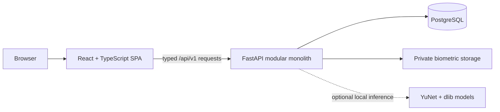
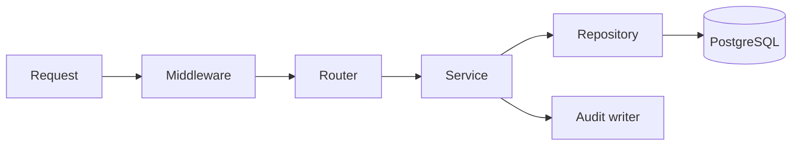
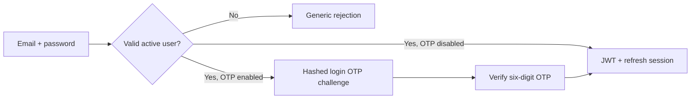
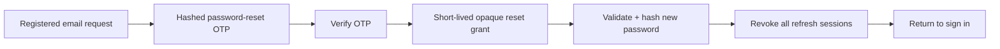
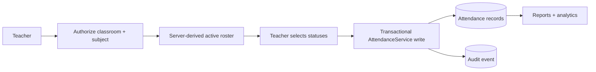
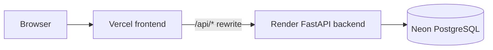

# ShikshaSathi Architecture

ShikshaSathi is a modular monolith: one React single-page application, one
FastAPI service, and one PostgreSQL database. Feature boundaries are kept in
code rather than split into separately deployed microservices.

## System overview

The authoritative application directories are:

- `frontend/`: React, TypeScript, Vite, routing, forms, and server-state UI.
- `backend_v2/`: FastAPI, business services, repositories, migrations, and
  tests.
- `backend/`: legacy Flask source retained for provenance; it is not deployed.

## Frontend architecture

The frontend is a Vite SPA using React Router, TanStack Query, React Hook Form,
and Zod.

- `src/api/client.ts` is the only HTTP transport. It normalizes the API root,
  sends cookie credentials, attaches the in-memory access token, parses safe
  error envelopes, and coordinates refresh/retry.
- Server state belongs to TanStack Query. Auth context exposes only the narrow
  current-user/session operations needed by components.
- The access token is memory-only. It is not stored in `localStorage`,
  `sessionStorage`, IndexedDB, or a JavaScript-created cookie.
- The backend-issued refresh token remains in an HttpOnly cookie and is never
  read or mirrored by JavaScript.
- Authenticated and role-specific route guards protect `/admin/*`,
  `/teacher/*`, and `/student/*`. Hidden navigation is not treated as an
  authorization boundary.
- Forms and workflows provide loading, empty, validation, error, and success
  states. Camera/file recognition inputs remain in browser memory only for the
  submission lifecycle.

On application bootstrap, the frontend attempts a cookie-backed refresh,
stores the returned access token in memory, then loads `/auth/me`. A protected
request that receives 401 joins one shared refresh operation and retries once;
refresh failure clears the local session and returns the user to login.

## Backend architecture

FastAPI routers are thin adapters over feature services and repositories:

`backend_v2/app/modules/` contains bounded modules for authentication, users,
academic resources, profiles, announcements, imports, attendance, reports,
analytics, biometric enrollment, and face recognition.

- Routers parse HTTP inputs and declare authentication/role dependencies.
- Services own business rules, authorization-sensitive orchestration, and
  transaction boundaries.
- Repositories own SQLAlchemy queries and flush changes without deciding HTTP
  behavior.
- Pydantic request/response schemas define the public contracts and generate
  OpenAPI.
- Typed application exceptions are converted to stable client-safe error
  envelopes with request IDs. Unexpected exceptions do not expose tracebacks,
  database errors, credentials, or filesystem paths.
- Structured logs exclude request bodies, authorization/cookie headers,
  passwords, tokens, OTP/reset grants, images, and embeddings.

## Database and transaction boundaries

PostgreSQL is the source of truth. SQLAlchemy uses asynchronous sessions and
Alembic owns schema history.

- UUID primary keys reduce predictable identifier enumeration.
- Standalone academic/profile records generally use soft deactivation so
  historical references remain intact.
- Genuine many-to-many relationships use association tables rather than
  comma-separated identifiers.
- Service-owned transactions make multi-record attendance writes atomic.
- Repositories translate integrity failures into stable domain errors.
- Attendance has one row per student/classroom/subject/date, protected by a
  database unique constraint.
- Audit logs are append-only through the application: the repository and API
  expose no update or delete path.
- Blocked attendance authorization events use an independent transaction so
  rolling back the rejected request does not erase the security event.

Compose and CI run migrations before application tests/startup. Downgrades are
manual and are never an automatic deployment action.

## Authentication and session architecture

Passwords use Argon2id. Access and refresh credentials deliberately have
different lifecycles:

- Access tokens are short-lived signed JWTs kept in frontend memory.
- JWT claims include identity and token metadata, but the current user and
  role are reloaded from PostgreSQL for protected requests.
- Refresh tokens are high-entropy opaque values. Only SHA-256 digests and
  session/rotation metadata are stored in PostgreSQL.
- Refresh tokens rotate under a row lock. Reuse of a replaced token revokes all
  active refresh sessions for the user.
- Refresh cookies are HttpOnly, path-scoped to authentication routes,
  SameSite-configured, and Secure in production.
- Cookie-authenticated refresh/logout requests enforce the explicit allowed
  origin boundary in addition to cookie protections.
- Login and other sensitive unauthenticated routes use bounded fixed-window
  rate limits. The current limiter is process-local, so horizontally scaled
  deployments require a shared limiter at the trusted ingress.

### Direct and OTP login

`LOGIN_OTP_ENABLED=false` preserves direct login. When enabled, valid
credentials create a purpose-bound, expiring challenge but do not create an
authenticated session. OTPs are cryptographically generated, stored only as
keyed digests, one-time use, attempt-limited, resend-replaced, cooldown-bound,
and rate-limited. SMTP is environment configured; the development log adapter
is rejected in production.

### Password reset

Login and reset OTPs have separate database purposes and purpose-separated
HMAC inputs. Neither can authorize the other flow. Public request/resend
responses are identical for active, inactive, and nonexistent accounts.

Successful OTP verification replaces the stored OTP digest with a digest of a
high-entropy reset grant. The raw grant is returned once, is bound to the
challenge/user, expires quickly, is accepted only by reset confirmation, and
never authenticates an API request. Confirmation row-locks and consumes the
grant, applies the existing password policy and Argon2id hashing, and revokes
all refresh sessions. Existing stateless access tokens cannot be recalled and
remain valid only until normal expiry.

## Authorization model

Roles are `admin`, `teacher`, and `student`.

| Role | Scope |
|---|---|
| Admin | Academic/profile management, imports, reports, audit reads, and biometric enrollment |
| Teacher | Reads and attendance operations only for exact active classroom/subject assignments |
| Student | Identity-derived own profile and attendance plus visible announcements |

Role denial is normally 403. A caller with an otherwise permitted role who
requests another user's private or unrelated object generally receives the
same 404 as a missing object, reducing existence disclosure. Teacher/student
scope is derived from the authenticated database user, profiles, assignments,
and classroom membership; client-supplied ownership identifiers are never
authoritative.

## Academic and attendance flow

Academic entities—classrooms, subjects, profiles, assignments, timetable, and
announcements—provide the relationship graph used for authorization.
Timetable writes require an active matching teacher/classroom/subject
assignment. Announcement visibility is global, role-based, or classroom-based.

Manual attendance follows this path:

The active roster provides minimal student identifiers for authorized manual
and recognition workflows. Attendance statuses are `present` or `absent`;
missing records are not silently interpreted as absence in analytics.

## Reports and analytics

Report requests require an exact authorized classroom/subject and a bounded
month or date range. Attendance detail is bounded, roster aggregations are
set-based, and deterministic ordering is used for leaderboards and exports.
Students do not receive arbitrary cross-student report endpoints.

- Attendance percentage is `present / marked records * 100`, rounded to two
  decimals; zero marked records returns `0.0`.
- Defaulters use the active roster, include zero-record students, and compare
  strictly below the selected threshold.
- CSV cells beginning with spreadsheet formula triggers are escaped.
- PDFs and CSVs are produced in memory without temporary report files.
- The analytics overview accepts 7- or 30-day windows, compares with the
  equal-duration preceding period, and derives scope from the current role.
- Missing or unmarked attendance is excluded; analytics do not make causal,
  predictive, or policy-compliance claims.

## Image-assisted attendance architecture

Biometric enrollment and recognition are separate modules. Enrollment owns
validated private samples and lifecycle state. Recognition owns detection,
alignment, embeddings, candidate-scoped matching, and review proposals.

```mermaid
flowchart LR
    Image["Bounded classroom image"] --> Authorize["Authorize teacher scope"]
    Authorize --> Candidates["Derive active roster candidates"]
    Candidates --> Detect["Detect + align faces"]
    Detect --> Embed["Create transient embeddings"]
    Embed --> Match["Roster-scoped matching"]
    Match --> Proposals["Persist non-biometric review proposals"]
    Proposals --> TeacherReview["Explicit teacher review"]
    TeacherReview --> Confirm["Confirm selected statuses"]
    Confirm --> AttendanceService["AttendanceService"]
```

Authorization and roster derivation happen before provider work. One bounded
image may produce multiple proposals. Every outcome—including `FOUND`—is only
a suggestion; no proposal writes attendance automatically. Unknown,
ambiguous, duplicate, missed, or unmarked faces never imply absence. Only
teacher-selected statuses reach `AttendanceService`.

The classroom image, decoded pixels, aligned crops, and per-request embeddings
remain in memory. Persisted reviews contain bounded scope, candidate,
decision, confirmation, and attendance identifiers—not image data or
embeddings. Matching has no institution-wide fallback.

The optional local provider uses OpenCV YuNet detection, landmark alignment,
dlib 128-dimensional L2-normalized embeddings, and cosine similarity. Model
paths and optional SHA-256 hashes are deployment configuration. The default
threshold is provisional rather than classroom-calibrated, and no liveness or
real-world accuracy claim is made. See the
[biometric data policy](BIOMETRIC_DATA_POLICY.md).

## Deployment architecture

### Hosted portfolio deployment

The browser uses same-origin `/api/v1` paths. Vercel serves the SPA and proxies
API requests to Render. Render runs the backend Docker image; Neon provides
PostgreSQL. CORS, trusted hosts, secrets, SMTP, cookie security, and optional
recognition-provider/model configuration remain explicit environment values.

The hosted deployment does not imply that face recognition is enabled. With
`FACE_RECOGNITION_PROVIDER=none`, recognition endpoints report the configured
unavailable state and no hosted inference occurs. Production OTP email also
does not work until SMTP is deliberately configured.

### Docker Compose

The default Compose topology contains PostgreSQL 16, a one-shot Alembic
migration service, the non-root FastAPI runtime, and an Nginx frontend. Only
Nginx publishes a host port; backend and database services stay on the private
network. PostgreSQL data and biometric storage use separate named volumes.

Production images use multi-stage builds, non-root users, read-only
filesystems where practical, dropped capabilities, health checks, and no
source bind mounts or reload servers. GitHub Actions runs migrations, backend
tests/static checks, frontend tests/typecheck/lint/build, dependency audits,
Compose validation, and production image builds.

## Operational boundaries

- No real `.env`, model weight, biometric sample, embedding export, database
  dump, or private key belongs in Git or a release archive.
- OpenAPI generated by FastAPI is authoritative for field-level API schemas.
- Biometric retention, consent, legal review, threshold calibration,
  anti-spoofing, backups, and monitoring remain deployment responsibilities.
- The legacy Flask/MongoDB code is not imported or deployed by the v2 stack.
